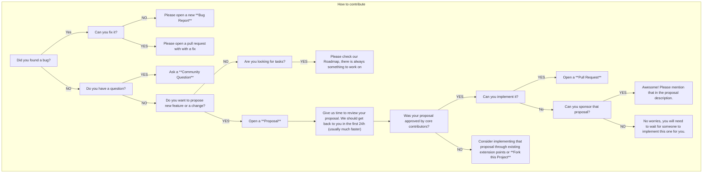

# Contributing

Below graph explains the process of contributing to Flow.  

## How to?

- [Submit a Bug Report](https://github.com/flow-php/flow/issues/new?template=bug)
- [Submit a Proposal](https://github.com/flow-php/flow/issues/new?template=proposal)
- Ask Community Question
  - [At Flow Discord Server](https://discord.gg/5dNXfQyACW) 
  - [At GitHub Discussions](https://github.com/flow-php/flow-php.com/discussions/categories/questions)
- [Sponsor Project of Proposal](http://flow-php.com/sponsor/)
- [Project Roadmap](https://github.com/orgs/flow-php/projects/1)

## Project Roadmap

> [!IMPORTANT]
> Flow PHP is managed through [GitHub Projects](https://github.com/orgs/flow-php/projects/1). 
> All code changes **MUST** first be added to the [Roadmap](https://github.com/orgs/flow-php/projects/1). 
> 
> Pull requests without an item in Roadmap might take significantly longer time to review or even get rejected due to missalignment
> with project architecture or future plans. In order to save time of contributors & maintainers, we would like to review
> the proposal before anyone starts to code. 
> 
> The only exception from that rule are Bug Fixes - those can be opened without opening a proposal first. 
> However it's still recommened to reach out as sometimes bugs might not be solvable imidiatelly or at all. 

If the idea you are planning to work on is not yet in the [Roadmap](https://github.com/orgs/flow-php/projects/1)
please create a new [Proposal Issue](https://github.com/flow-php/flow/issues/new?template=PROPOSAL) and wait for further guidance.

Proposal is considered "Accepted" when added to the Roadmap by one of the Core Contributors. 
By default proposal are added to the upcoming milestone, whatevr can't be delivered during milestone due date is going
to be moved to the next milestone.

> Weeks of coding can save you hours of planning. 

Opening a pull request without reaching out first might get rejected and eventually closed.   

**🐛 Bug Fixes** - bug fixes are the only exception from the above rule. Bug Fixes can be opened directly without a proposal issue.

## Before you start coding

Please make sure that you are aware of our [Architecture Decision Records](/documentation/adrs.md).
It's mandatory to follow all of them without any exceptions unless explicitly overridden by a new ADR.

## Next Steps

- [Setup development environment](/documentation/contributing/environment.md)
  - [Nix Shell](/documentation/contributing/nix.md)
- [Development Guidelines](/documentation/contributing/guidelines.md)
